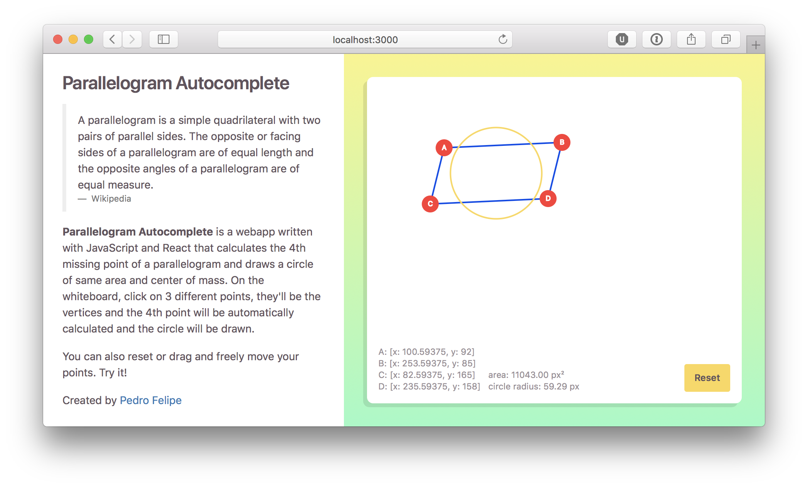

# React Parallelogram Autocomplete



Parallelogram Autocomplete is a webapp written with JavaScript and React that calculates the 4th missing point of a parallelogram and draws a circle of same area and center of mass. On the whiteboard, click on 3 different points, they'll be the vertices and the 4th point will be automatically calculated and the circle will be drawn.

The area is calculated with [Heron's formula](https://en.wikipedia.org/wiki/Heron%27s_formula).

## [Demo](https://se-parallelogram-autocomplete.herokuapp.com)

## Local Development

```bash
# Initial setup
npm install

# Start the server
npm start
```

## Production Build

```bash
npm build
```

## Tests

```bash
npm test
```

## Folder Structure

```
react-parallelogram-autocomplete/
  README.md
  package.json
  public/
    index.html
    favicon.ico
    manifest.json
  src/
    components/
    containers/
    css/
    presenters/
    index.js
```

## What’s Inside?

* [React](https://facebook.github.io/react)
* [Babel](http://babeljs.io)
* [webpack](https://webpack.js.org)
* [Sass](http://sass-lang.com)
* [Autoprefixer](https://github.com/postcss/autoprefixer)
* [Bootstrap](http://getbootstrap.com)
